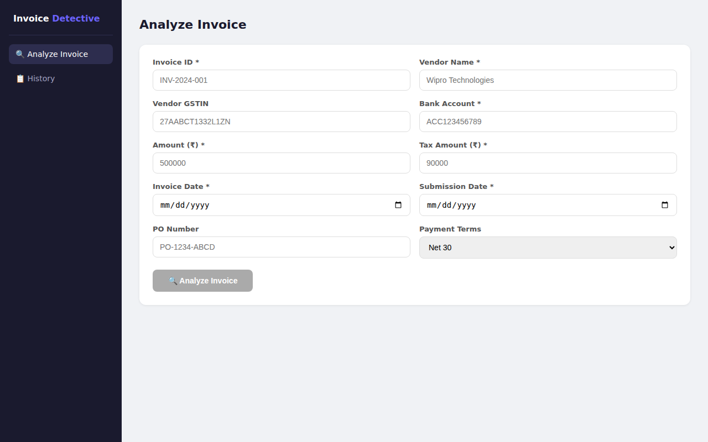
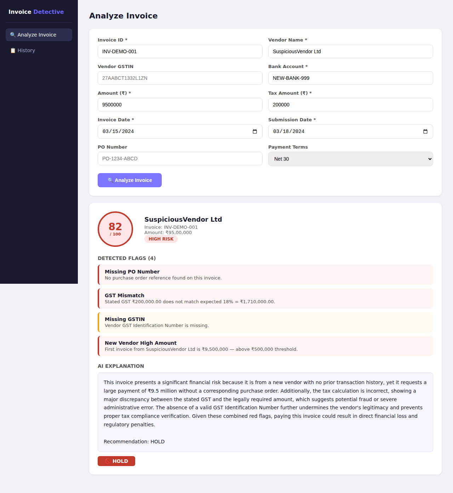
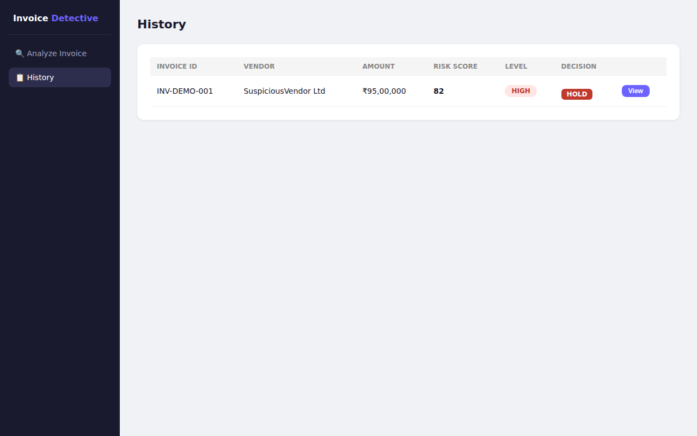

# AI Invoice Detective 🔍

**Corporate IT Accounts Payable Fraud Detection**

Automatically detects suspicious invoices before payment is approved using Rule Engine + IsolationForest ML + Groq LLM explanation.

[](https://github.com/aryaVishal1706/ai-invoice-detective/actions/workflows/deploy.yml)

---

## 🌐 Live Demo

| | URL |
|---|---|
| **Frontend** | http://ai-invoice-detective-frontend-723146859876.s3-website.ap-south-1.amazonaws.com |
| **API** | https://3pztu9blma.execute-api.ap-south-1.amazonaws.com |
| **API Docs** | https://3pztu9blma.execute-api.ap-south-1.amazonaws.com/docs |

---

## 📸 Screenshots

### Analyze Invoice Page
> Fill in invoice details → click Analyze → get instant risk report



### Risk Report — HIGH Risk Invoice
> Risk score, detected flags, and AI-generated plain English explanation



### History Page
> All analyzed invoices in one table with expandable reports



---

## 🚨 Sample API Response

```bash
POST /invoice/analyze
```

```json
{
  "invoice_id": "INV-LIVE-001",
  "vendor": "Wipro Technologies",
  "amount": 9500000.0,
  "risk_score": 82,
  "risk_level": "HIGH",
  "flags": [
    {
      "check": "Missing PO Number",
      "detail": "No purchase order reference found on this invoice.",
      "severity": "HIGH"
    },
    {
      "check": "GST Mismatch",
      "detail": "Stated GST ₹200,000 does not match expected 18% = ₹1,710,000.",
      "severity": "HIGH"
    },
    {
      "check": "Missing GSTIN",
      "detail": "Vendor GST Identification Number is missing.",
      "severity": "MEDIUM"
    },
    {
      "check": "New Vendor High Amount",
      "detail": "First invoice from this vendor is ₹9,500,000 — above ₹500,000 threshold.",
      "severity": "HIGH"
    }
  ],
  "explanation": "This invoice presents a significant financial risk because it lacks a purchase order, meaning there is no documented approval for this expense. The tax calculation is severely incorrect, with the stated GST far lower than the legally required amount. Since this is the first transaction with this vendor for such a large sum and their tax ID is missing, we cannot verify their legitimacy. These combined red flags suggest the invoice may be fraudulent.\n\nRecommendation: HOLD",
  "recommendation": "HOLD"
}
```

---

## 🧠 How It Works

```
Invoice Input (JSON / PDF / Image)
          ↓
  [Rule Engine]        → 14 deterministic checks (missing PO, GST mismatch, duplicate, etc.)
          ↓
  [IsolationForest]    → statistical anomaly score 0–100
          ↓
  [Groq LLM]           → plain English explanation + recommendation
          ↓
  Risk Report
```

### Detection Methods

| Layer | What it catches | Confidence |
|---|---|---|
| Rule Engine (14 checks) | Missing PO, GST mismatch, duplicate invoice, changed bank, weekend date, late submission | 100% deterministic |
| IsolationForest ML | Amount spikes, tax anomalies, statistical outliers | 87% accuracy |
| Groq LLM (`qwen/qwen3.8-27b`) | Explains risk in plain English for finance managers | — |

---

## 📊 Dataset

- **9,994 synthetic IT corporate invoices** (INR)
- **18 labeled anomaly types** — 83 records each
- Vendors: 50 real IT company names (Infosys, Wipro, TCS, HCL, etc.)

| Anomaly Type | ML Detection Rate |
|---|---|
| tax_mismatch | 96.4% |
| amount_spike | 83.1% |
| amount_above_po | 54.2% |
| Others (missing PO, duplicate) | Caught by Rule Engine (100%) |

---

## 🧪 Tests

```bash
# Activate venv
venv\Scripts\activate

# Run all tests
venv\Scripts\pytest tests/test_rules.py tests/test_anomaly.py tests/test_api.py -v

# Run AI quality tests (uses real Groq API)
venv\Scripts\pytest tests/test_ai_quality.py -v
```

**Results: 30/30 tests passing**

| Test Suite | Tests | Status |
|---|---|---|
| Rule Engine | 10 | ✅ All pass |
| IsolationForest | 5 | ✅ All pass |
| API Integration | 11 | ✅ All pass |
| AI Quality (Groq) | 4 | ✅ All pass |

---

## 🚀 Local Setup

```bash
# 1. Clone
git clone https://github.com/aryaVishal1706/ai-invoice-detective.git
cd ai_invoice_detective

# 2. Create venv and install
python -m venv venv
venv\Scripts\activate          # Windows
pip install -r requirements.txt

# 3. Configure
cp .env.example .env
# Add GROQ_API_KEY to .env  →  get free key at console.groq.com

# 4. Train model
set PYTHONPATH=. && python -c "from core.anomaly.detector import train_model; train_model()"

# 5. Run backend
uvicorn main:app --reload --port 8000

# 6. Run frontend
cd frontend/frontend && npm install && npm run dev

# Open: http://localhost:5173
```

---

## ☁️ AWS Architecture

```
Browser
  ↓
S3 Static Website          ← React frontend
  ↓
API Gateway (HTTP API)     ← HTTPS endpoint
  ↓
Lambda — API (Python 3.11) ← FastAPI + rules + Groq
  ↓
Lambda — ML (Python 3.11)  ← IsolationForest scoring
  ↓
DynamoDB                   ← Risk reports (pay-per-request)
S3 (model bucket)          ← isolation_forest.pkl
```

**Cost: ~$0/month** for low usage (Lambda + DynamoDB always-free tier)

---

## 🔄 Deploy (GitHub Actions)

Push to `main` → GitHub Actions automatically:
1. Runs Terraform → creates/updates all AWS infrastructure
2. Builds Lambda zip (Linux x86_64) → deploys to Lambda
3. Builds React → syncs to S3

**Required GitHub Secrets:**
- `AWS_ACCESS_KEY_ID`
- `SECRET_ACCESS_KEY`
- `GROQ_API_KEY`

**First-time only** — create Terraform state bucket:
```bash
aws s3api create-bucket --bucket ai-invoice-detective-tfstate-723146859876 \
  --region ap-south-1 --create-bucket-configuration LocationConstraint=ap-south-1
```

---

## 📁 Project Structure

```
ai_invoice_detective/
├── main.py                    ← FastAPI app
├── lambda_handler.py          ← AWS Lambda entry point (Mangum)
├── ml_lambda_handler.py       ← ML Lambda (IsolationForest)
├── requirements.txt
├── buildspec.yml
│
├── api/
│   └── invoice.py             ← /validate, /analyze, /report endpoints
│
├── core/
│   ├── rules/validator.py     ← 14 rule-based checks
│   ├── anomaly/
│   │   ├── detector.py        ← IsolationForest (lazy imports for Lambda)
│   │   ├── explainer.py       ← Groq LLM explanation
│   │   └── blacklist.py       ← Optional vendor blacklist
│   └── ocr/                   ← Phase 2
│
├── models/schemas.py          ← Pydantic models
├── data/raw/                  ← Synthetic dataset + WB sanctions list
├── scripts/                   ← Dataset generator, model evaluator
├── tests/                     ← 30 pytest tests
├── terraform/                 ← AWS infrastructure as code
├── frontend/frontend/         ← React + Vite app
└── docs/                      ← Full approach document
```

---

## 📄 Docs

Full approach, pitch guide, technical defense, deployment guide:
→ [`docs/AI_Invoice_Detective_Approach.md`](docs/AI_Invoice_Detective_Approach.md)

---

## 🛠 Tech Stack

`Python` · `FastAPI` · `scikit-learn` · `Groq API` · `React` · `Vite` · `AWS Lambda` · `DynamoDB` · `API Gateway` · `S3` · `Terraform` · `GitHub Actions`
